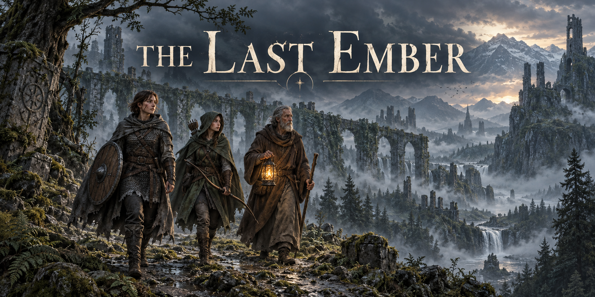

# The Last Ember



A local-first solo deckbuilding adventure. Mara, Eryn, and Aldren carry the last
living ember through a forest frontier, a fallen kingdom, and a mountain pass.
One shared deck, one health pool, and magic that attracts the dark.

## Run

Use Bun 1.3.10.

```sh
bun install --frozen-lockfile
bun run dev
```

## Check

```sh
bun run check
bun run build
bun run preview
```

The game uses React, TypeScript, and Vite in one package. GSAP and PixiJS render
combat effects; the deterministic engine has no browser dependencies. Assets and
fonts are local. Progress saves after each committed action, before animation.

## Guides

- [Rules](docs/game/rulebook.md) and [playing the game](docs/game/player-guide.md)
- [Development and browser verification](docs/development/README.md)
- [Architecture and import boundaries](docs/development/architecture.md)
- [Autonomous playtesting](docs/laboratory/README.md)
- [Art provenance](docs/art/README.md)
- [Retained experiment evidence](experiments/README.md)

Start an autonomous journey with
`bun scripts/lab/lab.ts journey --games 1 --bot strategic --seed demo`.
Scratch outputs belong in ignored `artifacts/`; retained experiments stay versioned.
